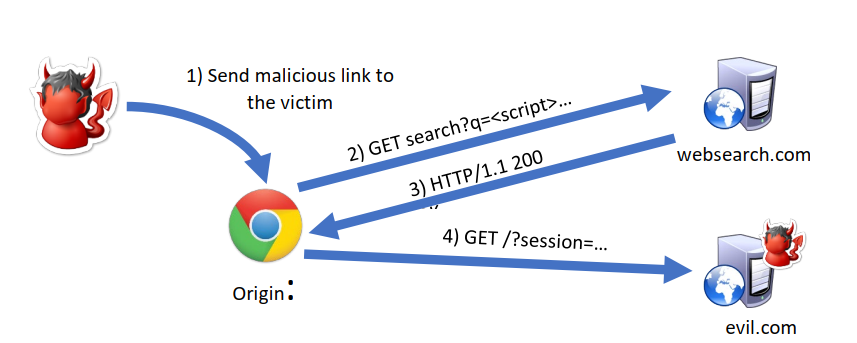
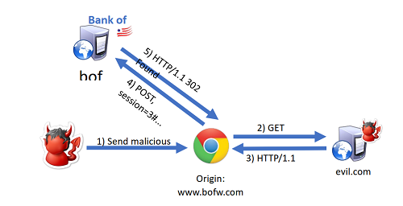
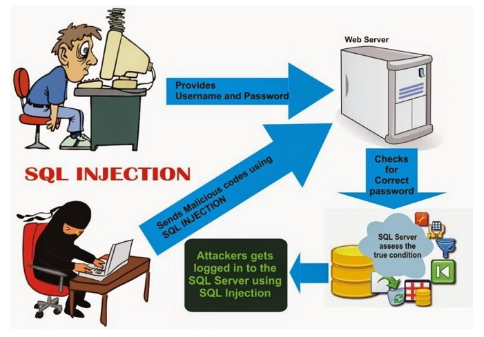

Nama : Defrian Afandi<br>
NIM : 09021281722075<br>
Mata kuliah : Keamanan Jaringan Komputer<br>
Kelas : Teknik Informatika<br>
Fakultas Ilmu Komputer, Universitas Sriwijaya.<br>


#### SOAL:
##### Web Apps Vuln
1. Apakah yang dimaksud dengan celah pada aplikasi web (Web Apps Vulnerable)?<br>
Jawab :<br>
Celah aplikasi web melibatkan cacat atau kelemahan sistem dalam aplikasi berbasis web<br>
yang dapat dieksploitasi untuk membahayakan keamanan aplikasi.<br>
<br>
- Sumber : https://www.veracode.com/security/web-application-vulnerabilities<br>
<br>

2. Jelaskan beberapa exploitasi yang dapat terjadi pada Web Apps!<br>
Jawab :<br>
Beberapa exploitasi yang dapat terjadi pada Web Apps adalah sebagai berikut :<br>
- Injection<br>
Dalam praktik penggunaan SQL, OS, dan LDAP, injeksi adalah hal yang sangat riskan untuk terjadi.<br>
Injeksi biasanya dilakukan dengan memasukkan data yang tidak terpercaya ke dalam interpreter sebagai<br>
bagian dari command atau query. Data yang dimasukkan oleh injektor dapat menipu interpreter untuk meng-<br>
eksekusi perintah tertentu atau mengakses data rahasia tanpa izin.<br> 

- Broken Authentication and Session Management<br>
Fungsi pada aplikasi berbasis web yang berkaitan dengan autentifikasi dan manajemen sesi seringkali<br>
tidak terimplementasikan dengan baik. Apabila hal ini terjadi di level parah, penyerang sistem akan<br>
dengan mudah mencuri dan memanfaatkan password serta data pribadi lainnya yang akan merugikan pengguna.<br>

- Cross-Site Scripting (XSS)<br>
Kelemahan dalam XSS terjadi ketika sebuah aplikasi mengakses data yang tidak terpercaya dan mengirimkannya<br
lewat web tanpa ada konfirmasi validasi sebagaimana mestinya. Kejadian XSS akan memberikan keleluasaan<br>
bagi penyerang sistem untuk menggunakan script dari browser guna mengakses web tanpa izin. Misalnya mengarahkan<br>
ke website palsu atau bahkan melakukan redirect ke situs berbahaya.<br>

- Insecure Direct Object References<br>
Objek langsung di sini berkaitan ketika developer mengekspos referensi ke dalam implementasi objek internal.<br>
Misalnya ke file, direktori, atau database key. Tanpa memiliki accsess control check dan perlindungan lain,<br>
penyerang dapat memanipulasi referensi ini untuk mengakses data rahasia.<br>

- Security Misconfiguration <br>
Selama ini, sistem keamanan yang bagus membutuhkan konfigurasi yang terjamin guna mengakses aplikasi,<br>
framework, web server, aplikasi server, database server, hingga platform.  Sebab, setingan default<br>
seringkali tidak aman. Selain itu, pembaruan rutin terhadap software pun menjadi sebuah keharusan.<br>

- Sensitive Data Exposure
Banyak aplikasi berbasis web yang belum melindungi data sensitif secara layak. Misalnya data kartu<br>
kredit hingga data autentifikasi. Penyerang sistem sangat mungkin mencuri atau memodifikasi data<br>
bersistem pengamanan lemah tersebut untuk melakukan tindakan penipuan, pencurian identitas, atau<br>
kriminalitas lain.<br>

- Missing Function Level Access Control<br>
Mayoritas aplikasi berbasis web akan memverifikasi fungsi akses sebelum membuat fungsi tersebut<br>
ada di user interface. Faktanya, aplikasi juga perlu melakukan kontrol akses yang sama ke server<br>
tiap kali fungsi itu dijalankan. Apabila permintaan tidak terverifikasi, maka penyerang bisa dengan<br>
mudah mengakses fungsi privat tanpa izin.<br>

- Cross-Site Request Forgery (CSRF)<br>
Cara kerja CSRF adalah dengan memaksa masuk ke browser pengguna yang kemudian mengirimkan permintaan<br>
HTTP, termasuk cookies, serta berbagai informasi rahasia yang tersimpan di browser, ke aplikasi web<br>
gadungan. Hal ini akan membuat pengguna seolah-olah mengakses aplikasi tersebut secara langsung, padahal tidak.<br>

- Using Known Vulnerable Components<br>
Komponen dasar seperti database, famework, dan berbagai modul software kebanyakan dijalankan dengan hak<br>
penuh. Apabila komponen yang riskan dieksploitasi, bisa menyebabkan kehilangan data dan pengambil-alihan server.<br>

- Unvalidated Redirects and Forwards<br>
Aplikasi berbasis web yang digunakan user seringkali melakukan redirect dan forward ke halaman lain atau<br>
bahkan website lain. Tindakan semacam ini, tanpa validasi yang benar, dapat mengarahkan user ke laman<br>
phishing, malware, maupun menggunakannya untuk mengakses laman berbahaya lain.<br>
<br>
- Sumber :https://blog.gamatechno.com/10-celah-keamanan-aplikasi-berbasis-web/<br>
<br>

3. Jelaskan maksud dari pesan HTTP pada paket data di bawah berikut!
Jawab :<br>

```
GET /test/index.php HTTP/1.1
```
Mengambil data dari /test/index.php dengan menggunakan HTTP/1.1<br>
```
Host: 35.240.164.125
```
Pengaksesan ke host 35.240.164.125<br>
```
User-Agent: Mozilla/5.0 (X11; Ubuntu; Linux x86_64; rv:70.0) Gecko/20100101 Firefox/70.0
```
Jenis dan versi device yang dipakai untuk melakukan operasi HTTP<br>
```
Accept: text/html,application/xhtml+xml,application/xml;q=0.9,*/*;q=0.
```
Jenis konten yang akan diambil antara bertipe text/html, application/xhtml+xml, etc<br>
```
Accept-Language: en-US,en;q=0.5
```
Jenis Bahasa yang di akan dibawa adalah en-US,en;q=0.5<br>
```
Accept-Encoding: gzip, deflate
```
Jenis encoding yang dilakukan adalah gzip, deflate<br>
```
Referer: http://35.240.164.125/test/login.php
```
Alamat yang dituju<br>
```
Connection: keep-alive
```
Jenis koneksi yang dipakai adalah keep-alive<br>
```
Cookie: security=low; PHPSESSID=p00u0h65mngqicaitmrnaimgk0
```
Jenis Cookie dan keamanannya, yang dalam pesan ini cookie yang digunakan adalah PHPSESSID,<br>
cookie yang hanya disimpan pada website tidak pada browser user.<br>
```
Upgrade-Insecure-Requests: 1
```
Permintaan untuk meningkatkan keamanan request menjadi https<br>
<br>
Sumber : 9_Web_Exploits.pptx<br>
<br>

##### XSS
1. Jelaskan apa yang dimaksud dengan XSS attack, sebutkan ciri - ciri serangannya! Note *tambahan : berikan secara visual proses serangan tersebut<br>
Jawab:<br>
XSS adalah salah satu jenis serangan injeksi code (code injection attack). XSS dilakukan<br>
oleh penyerang dengan cara memasukkan kode HTML atau client script code lainnya ke suatu situs.<br>
Serangan ini akan seolah-olah datang dari situs tersebut. Akibat serangan ini antara lain penyerang<br>
dapat mem-bypass keamanan di sisi klien, mendapatkan informasi sensitif, atau menyimpan aplikasi berbahaya.<br>
- Ciri-cirinya: pengaksesan code melalui link, penyimpanan code di server.<br>
Contoh gambar :<br>

<br>
- Sumber : https://upyes.wordpress.com/2013/05/18/pengertian-xss/ dan 9_Web_Exploits.pptx<br>
<br>

2. Pada serangan XSS atau Cross Site Scripting, terdapat script yang dapat dilakukan serangan, berikan penjelasan pada script xss attack injection berikut:<br>
Jawab:<br>

```
<script>alert(document.cookie)</script>
```
Menjelaskan bahwa hacker ingin mengambil cookie dari user dengan memasukan script tersebut<br>
dan akan menampilkan langsung kembalian / alert dokumen yang berisi cookie user tersebut<br>

```
<script>document.write('');</script>
```
Menjelaskan bahwa hacker ingin mendapatkan cookie user dengan cara memasukan script pada<br>
source image yang berisi sebuah alamat website hacker yaitu http://evil.com/? untuk <br>
menampung cookie nya. Mekanismenya yaitu, web tersebut akan membaca script tersebut yang<br>
berisi sebuah gambar namun ketika gambar tersebut di load oleh user maka gambar yang berisi<br>
script tadi akan mengembalikan cookie user melalui website yang sudah di sisipkan.<br>
<br>
- Sumber: 9_Web_Exploits.pptx <br>
<br>

##### CSRF & SQL Injection
1. Jelaskan proses kerja dari serangan Cross-Site Request Forgery (CSRF). Note: *tambahan, berikan secara visual proses serangan tersebut<br>
Jawab : <br>
Eksploitasi ini memanfaatkan identitas korban untuk melakukan request yang tidak<br>
diinginkan di apps. Ada 2 proses yang bisa terjadi:<br>
- GET Process, dengan cara membuat user menjalankan perintah get yang berisi code<br>
yang menguntungkan penyerang.
- POST Process, dengan cara mengelabui user untuk mensubmit code tertentu yang diinginkan<br>
attacker (code ini bisa dijalankan otomatis dengan menggunakan javascript).<br>
<br>

<br>
- Sumber: 9_Web_Exploits.pptx dan http://www.owasp.org/index.php/Cross-Site_Request_Forgery_(CSRF)
<br>

2. Jelaskan proses serangan pada SQL injection! Note: *tambahan, berikan secara visual proses serangan tersebut<br>
Jawab :<br>
SQL injection atau biasa yang dikenal dengan sebutan SQLi adalah suatu teknik penyerangan<br>
web dengan menggunakan kode SQL (Structured Query Language) yang berbahaya untuk memanipulasi<br>
database. Tindakan ini termasuk kedalam kategori hacking, dimana penyerang akan mencari celah<br>
keamanan dari suatu website.<br>
Sebagai contoh sederhana, biasanya pengguna diminta untuk memasukkan username dan password<br>
yang hanya dapat berupa karakter angka dan huruf. Sedangkan user memasukkan karakter lain,<br>
seperti petik tunggal (‘), strip (-) atau tanda (=). Karakter-karakter tersebut merupakan bagian<br>
dari perintah umum yang digunakan untuk dapat berinteraksi dengan database. Keadaan itulah yang<br>
dimanfaatkan oleh penyerang untuk dapat mengakses informasi yang tersimpan didalam database.<br>
<br>
Cara kerja sql injection yaitu hacker akan mencoba mencari sebuah website yang sekiranya<br>
keamanan pada website tersebut lemah atau terdapat celah yang bisa di hack website nya. Caranya<br>
yaitu memasukan sebuah sql pada form login yang berisi untuk mengakses database nya, atau berisi<br>
sql yang bisa merusak database saat dibaca oleh wibesitenya. Misalnya, terdapat pengguna <br>
memiliki username “Hakim” dan password “adaaja”. Jika pengguna melakukan inputan sesuai data<br>
tersebut, maka tidak akan menjadi masalah pada sistem database karena memang data itu yang<br>
tersimpan didalamnya. Akan tetapi, jika pengguna membuat username menjadi “Hakim #” maka<br>
karakter ‘#’ akan menyebabkan karakter selanjutnya tidak dianggap sebagai kode SQL. Akibatnya,<br>
maka username Hakim dapat tetap input ke sistem tanpa harus mengetahui password tersebut.<br>
Atau cara kerja SQL injection berikutnya adalah dengan mengganti password menjadi kode SQL,<br>
yaitu password = ‘ OR 1=1’. Yang terjadi adalah pengguna“Hakim” tetap berhasil login ke sistem<br>
karena inputan password tersebut merupakan kodel SQL yang menandakan bahwa proses login berhasil.<br>
<br>

<br>
- Sumber : https://www.nesabamedia.com/pengertian-sql-injection/<br>
<br>

3. Pada serangan SQL injection, beberapa payload yang di lakukan oleh attacker *di bawah. berikan penjelasan mengenai payload SQL Injection tersebut beserta dengan SQL query statement:

```
http://website-target.com/?id=%27+union+all+select+system_user%28%29%2Cuser%28%29+%23&Submit=Submit#
```

```
' union all select system_user(),user() #
```
Jawab :<br>
Kedua payload tersebut sebenarnya mempunyai maksud yang sama, pada payload yang pertama melakukan<br>
sql injection pada sebuah website ,sedangkan pada payload kedua malakukan syntax query sql.<br>
Pada payload pertama pada bagian id itu sebenernya jika kita decode html nya maka hasilnya sama<br>
dengan payload yang kedua, hanya saja bentuk pada payload pertama seperti itu karena pada payload<br>
pertama itu bentuknya url maka dalam url tidak boleh ada symbol petik (‘) koma (,) dan simbol-simbol<br>
lainnya yang dilarang dalam url. Pada parameter id tersebut bertujuan untuk mengetahui system apa<br>
yang di gunakan pada server tersebut. Jadi kedua query statement tersebut memiliki tujuan yang sama,<br>
yaitu untuk mengetahui informasi sistem apa yang dipakai pada server tersebut, mengetahui informasi<br>
system user dan user nya.<br>
<br>